# ERD Sistem Operasional Salon

## Status dan batas rancangan

ERD ini adalah target schema untuk fondasi operasional dan implementasi awal yang telah disetujui. Diagram mengikuti nama tabel/kolom pada rancangan migration operasional, bukan menyatakan bahwa seluruh workflow bisnis sudah selesai.

Termasuk dalam ERD:

- employee dan master operasional;
- reservasi multi-treatment dan multi-staff;
- snapshot harga/komisi serta timestamp pekerjaan;
- invoice satu-per-kunjungan dan split payment manual;
- fondasi stok, kas, payroll ringkas, dan activity log.

Belum termasuk dan harus dibuat melalui migration phase terpisah:

- commission ledger dan commission rule versioning;
- overtime ledger dan approval;
- attendance;
- payroll periods/components serta payslip final;
- stock receipts/usages lengkap;
- expense category/expense dan cash closing;
- staging/import Excel.

Tabel role/permission milik `spatie/laravel-permission` tetap digunakan tetapi tidak ditampilkan agar diagram berfokus pada domain operasional. `users` tetap menjadi actor autentikasi/RBAC.

## Diagram relasi

```mermaid
erDiagram
    USERS {
        bigint id PK
        string name
        string email UK
    }

    EMPLOYEES {
        bigint id PK
        bigint user_id FK,UK "nullable"
        string code UK
        string name
        string position "nullable"
        string specialty "nullable"
        boolean is_service_provider
        boolean active
        timestamp created_at
        timestamp updated_at
    }

    TREATMENT_CATEGORIES {
        bigint id PK
        string code UK
        string name UK
        text description "nullable"
        smallint sort_order
        boolean is_active
        timestamp created_at
        timestamp updated_at
    }

    TREATMENTS {
        bigint id PK
        bigint category_id FK
        string code UK
        string name
        smallint duration_minutes
        bigint normal_price
        decimal default_commission_percent
        boolean is_active
        text description "nullable"
        timestamp created_at
        timestamp updated_at
    }

    UNITS {
        bigint id PK
        string code UK
        string name UK
        smallint decimal_places
        boolean is_active
        timestamp created_at
        timestamp updated_at
    }

    PRODUCTS {
        bigint id PK
        string code UK
        string name
        string category "nullable"
        bigint purchase_unit_id FK
        bigint usage_unit_id FK
        decimal purchase_to_usage_factor
        decimal current_stock
        decimal minimum_stock
        bigint selling_price
        boolean is_active
        text description "nullable"
        timestamp created_at
        timestamp updated_at
    }

    TREATMENT_PRODUCT_RECIPES {
        bigint id PK
        bigint treatment_id FK
        bigint product_id FK
        bigint unit_id FK
        decimal quantity
        timestamp created_at
        timestamp updated_at
    }

    CUSTOMERS {
        bigint id PK
        string code UK
        string name
        string phone UK "nullable"
        string email UK "nullable"
        date birth_date "nullable"
        text address "nullable"
        boolean is_member
        date member_since "nullable"
        int visit_count
        text notes "nullable"
        boolean is_active
        timestamp created_at
        timestamp updated_at
    }

    PROMOTIONS {
        bigint id PK
        string code UK
        string name
        string discount_type
        decimal discount_percent
        bigint discount_amount
        date starts_at
        date ends_at
        boolean members_only
        boolean is_active
        text description "nullable"
        timestamp created_at
        timestamp updated_at
    }

    RESERVATIONS {
        bigint id PK
        string booking_code UK
        string queue_number
        bigint customer_id FK
        date reservation_date
        time reservation_time
        string source
        string status
        text general_notes "nullable"
        bigint created_by FK "nullable"
        bigint updated_by FK "nullable"
        bigint cancelled_by FK "nullable"
        timestamp cancelled_at "nullable"
        text cancellation_reason "nullable"
        timestamp created_at
        timestamp updated_at
    }

    RESERVATION_ITEMS {
        bigint id PK
        bigint reservation_id FK
        bigint treatment_id FK
        string treatment_name "snapshot"
        smallint duration_minutes "snapshot"
        bigint normal_price "snapshot"
        bigint unit_price "snapshot"
        decimal discount_percent "snapshot"
        bigint discount_amount "snapshot"
        bigint net_price "snapshot"
        decimal commission_percent "snapshot"
        bigint commission_amount "snapshot"
        timestamp scheduled_start_at
        timestamp scheduled_end_at
        timestamp started_at "nullable"
        timestamp finished_at "nullable"
        timestamp ready_at "nullable"
        timestamp continued_at "nullable"
        timestamp overtime_at "nullable"
        timestamp cancelled_at "nullable"
        string work_status
        text notes "nullable"
        smallint sort_order
        timestamp created_at
        timestamp updated_at
    }

    RESERVATION_ITEM_STAFF {
        bigint id PK
        bigint reservation_item_id FK
        bigint employee_id FK
        string role
        decimal commission_percent "allocation snapshot"
        bigint commission_amount "allocation snapshot"
        text conflict_override_reason "nullable"
        bigint conflict_overridden_by FK "nullable"
        timestamp conflict_overridden_at "nullable"
        timestamp created_at
        timestamp updated_at
    }

    PAYMENT_METHODS {
        bigint id PK
        string code UK
        string name UK
        string type
        boolean is_cash
        boolean requires_reference
        boolean is_active
        smallint sort_order
        timestamp created_at
        timestamp updated_at
    }

    TRANSACTIONS {
        bigint id PK
        string number UK
        bigint reservation_id FK,UK
        bigint customer_id FK
        string status
        timestamp transacted_at "nullable"
        bigint subtotal
        decimal discount_percent
        bigint discount_amount
        bigint total
        bigint paid_amount
        bigint change_amount
        string idempotency_key UK "nullable"
        text notes "nullable"
        bigint created_by FK "nullable"
        bigint finalized_by FK "nullable"
        timestamp finalized_at "nullable"
        bigint voided_by FK "nullable"
        timestamp voided_at "nullable"
        text void_reason "nullable"
        timestamp created_at
        timestamp updated_at
    }

    TRANSACTION_ITEMS {
        bigint id PK
        bigint transaction_id FK
        bigint reservation_item_id FK "nullable"
        string item_type
        bigint item_id "nullable"
        string name "snapshot"
        decimal quantity
        bigint unit_price "snapshot"
        bigint gross_amount
        decimal discount_percent
        bigint discount_amount
        bigint total_amount
        smallint sort_order
        timestamp created_at
        timestamp updated_at
    }

    TRANSACTION_PAYMENTS {
        bigint id PK
        bigint transaction_id FK
        bigint payment_method_id FK
        bigint amount
        string reference_number "nullable"
        timestamp paid_at
        string status
        text notes "nullable"
        bigint received_by FK "nullable"
        timestamp created_at
        timestamp updated_at
    }

    STOCK_MOVEMENTS {
        bigint id PK
        bigint product_id FK
        bigint unit_id FK
        string type
        decimal quantity
        decimal stock_before
        decimal stock_after
        bigint unit_cost "nullable"
        string source_type
        bigint source_id "nullable"
        string reference "nullable"
        text notes "nullable"
        timestamp occurred_at
        bigint created_by FK "nullable"
        timestamp created_at
        timestamp updated_at
    }

    CASH_ENTRIES {
        bigint id PK
        bigint transaction_payment_id FK,UK "nullable"
        string type
        string category
        text description
        bigint amount
        date entry_date
        string status
        bigint created_by FK "nullable"
        bigint approved_by FK "nullable"
        timestamp approved_at "nullable"
        timestamp created_at
        timestamp updated_at
    }

    PAYROLLS {
        bigint id PK
        bigint employee_id FK
        string period
        string employee_name "snapshot"
        string position "snapshot nullable"
        bigint base_salary
        bigint bonus
        bigint overtime
        bigint commission
        bigint late_deduction
        bigint other_deduction
        bigint net_salary
        int late_duration_minutes
        string status
        bigint finalized_by FK "nullable"
        timestamp finalized_at "nullable"
        timestamp created_at
        timestamp updated_at
    }

    ACTIVITY_LOGS {
        bigint id PK
        bigint user_id FK "nullable"
        string action
        string subject_type
        bigint subject_id "nullable logical reference"
        text description
        json metadata "nullable"
        string ip_address "nullable"
        text user_agent "nullable"
        timestamp created_at
        timestamp updated_at
    }

    USERS o|--o| EMPLOYEES : "login profile"
    TREATMENT_CATEGORIES ||--o{ TREATMENTS : classifies
    UNITS ||--o{ PRODUCTS : "purchase unit"
    UNITS ||--o{ PRODUCTS : "usage unit"
    TREATMENTS ||--o{ TREATMENT_PRODUCT_RECIPES : has
    PRODUCTS ||--o{ TREATMENT_PRODUCT_RECIPES : consumed_by
    UNITS ||--o{ TREATMENT_PRODUCT_RECIPES : measured_in
    CUSTOMERS ||--o{ RESERVATIONS : books
    RESERVATIONS ||--|{ RESERVATION_ITEMS : contains
    TREATMENTS ||--o{ RESERVATION_ITEMS : snapshots
    RESERVATION_ITEMS ||--|{ RESERVATION_ITEM_STAFF : assigned_to
    EMPLOYEES ||--o{ RESERVATION_ITEM_STAFF : works_on
    USERS o|--o{ RESERVATIONS : audits
    USERS o|--o{ RESERVATION_ITEM_STAFF : overrides
    RESERVATIONS ||--o| TRANSACTIONS : invoiced_once
    CUSTOMERS ||--o{ TRANSACTIONS : owns
    TRANSACTIONS ||--|{ TRANSACTION_ITEMS : contains
    RESERVATION_ITEMS o|--o{ TRANSACTION_ITEMS : billed_as
    TRANSACTIONS ||--|{ TRANSACTION_PAYMENTS : paid_with
    PAYMENT_METHODS ||--o{ TRANSACTION_PAYMENTS : labels
    USERS o|--o{ TRANSACTION_PAYMENTS : receives
    TRANSACTION_PAYMENTS ||--o| CASH_ENTRIES : posts
    PRODUCTS ||--o{ STOCK_MOVEMENTS : changes
    UNITS ||--o{ STOCK_MOVEMENTS : measured_in
    EMPLOYEES ||--o{ PAYROLLS : receives
    USERS o|--o{ ACTIVITY_LOGS : acts
```



## Aggregate dan ownership

### Reservation aggregate

```text
Reservation
├── customer_id
├── visit-level date, source, status, queue, notes
└── ReservationItem[]
    ├── treatment and financial snapshots
    ├── scheduled and actual timestamps
    ├── work status
    └── ReservationItemStaff[]
        ├── employee and operational role
        ├── commission allocation snapshot
        └── conflict override audit
```

Satu `reservation` wajib dimiliki satu customer. Setiap reservation wajib mempunyai minimal satu item pada level aplikasi. Setiap item treatment wajib mempunyai minimal satu staff untuk treatment yang memang membutuhkan service provider; database foreign key sendiri tidak dapat menjamin minimal satu child, sehingga aturan ini divalidasi dalam service/request dan test.

### Transaction aggregate

```text
Transaction (unique reservation_id)
├── customer_id yang sama dengan reservation
├── TransactionItem[] dari snapshot reservation item/produk
└── TransactionPayment[]
    └── PaymentMethod sebagai label rekonsiliasi manual
```

Unique `transactions.reservation_id` menegakkan satu invoice per kunjungan. `transactions.customer_id` disimpan untuk query/report, tetapi backend wajib memastikan nilainya sama dengan customer reservation; client tidak memilih customer saat checkout.

Jumlah payment harus sama persis dengan `transactions.total` sebelum transaction difinalisasi. Tidak ada payment gateway: `reference_number` adalah catatan manual, dan `confirmed` berarti dikonfirmasi operator, bukan diverifikasi bank secara otomatis.

### Stock aggregate

`products.current_stock` adalah saldo cepat dalam usage unit. Setiap perubahan saldo wajib membuat `stock_movements` yang merekam quantity, unit, saldo sebelum, saldo sesudah, sumber, waktu, dan actor. `source_type`/`source_id` adalah logical reference; service bertanggung jawab memastikan referensinya valid.

## Invariant database dan aplikasi

| Invariant | Penegakan |
|---|---|
| Employee hanya terhubung ke paling banyak satu akun | Unique nullable `employees.user_id` |
| Kode master stabil dan unik | Unique `code` pada employee, category, treatment, unit, product, customer, promo, dan payment method |
| Antrean unik per tanggal | Unique (`reservation_date`, `queue_number`) |
| Pegawai tidak diduplikasi dalam item yang sama | Unique (`reservation_item_id`, `employee_id`) |
| Satu resep per treatment–product | Unique (`treatment_id`, `product_id`) |
| Satu invoice per reservation | Unique `transactions.reservation_id` |
| Retry checkout tidak menggandakan transaksi | Unique nullable `transactions.idempotency_key` ditambah handling service |
| Satu cash posting per bagian pembayaran | Unique nullable `cash_entries.transaction_payment_id` |
| Satu payroll bridge per employee/periode | Unique (`employee_id`, `period`) |
| Split payment harus tepat sama dengan total | Validation dan kalkulasi backend di dalam transaction |
| Konflik tanpa override tidak boleh tersimpan | Conflict service; HTTP 409 sebelum commit |
| Override dapat diaudit | Permission, alasan, `conflict_overridden_by`, `conflict_overridden_at`, dan activity log |
| Stok tidak berkurang ganda/negatif | Row lock, idempotency, stock before/after, dan atomic checkout |

## Tipe data dan aturan snapshot

- Nilai Rupiah memakai `unsignedBigInteger`.
- Persentase memakai `decimal(7,4)`; kalkulasi backend harus menggunakan integer/decimal-safe math, bukan `float`.
- Quantity dan faktor konversi memakai `decimal(18,4)`.
- Datetime operasional memakai timestamp dan diperlakukan konsisten dalam timezone bisnis `Asia/Jakarta`.
- `reservation_items` menyimpan nama treatment, durasi, harga normal/aktual/net, diskon, dan komisi sebagai snapshot.
- `reservation_item_staff` menyimpan alokasi komisi per pegawai sebagai snapshot, tetapi nilai ini belum menjadi commission ledger sampai phase komisi.
- `transaction_items` kembali menyimpan snapshot nama dan nilai invoice agar perubahan reservasi/master tidak mengubah invoice final.
- `payrolls.employee_name` dan `position` adalah snapshot sementara untuk kompatibilitas tampilan; payroll periods/components akan menggantikannya sebagai sumber audit pada phase payroll.

## Status awal

### Reservation

| Kode | Label UI | Makna |
|---|---|---|
| `scheduled` | Terjadwal | Kunjungan sudah dibuat |
| `arrived` | Sudah datang | Pelanggan sudah hadir |
| `in_service` | Sedang dilayani | Sedikitnya satu item sedang dikerjakan |
| `completed` | Selesai | Semua item selesai/cancelled dan invoice valid sudah diproses sesuai aturan service |
| `cancelled` | Batal | Kunjungan dibatalkan dengan alasan/actor |

### Reservation item

| Kode | Timestamp terkait |
|---|---|
| `waiting` | Belum ada timestamp aktual |
| `in_progress` | `started_at` |
| `continue` | `continued_at` |
| `ready` | `ready_at` |
| `finished` | `finished_at` |
| `overtime` | `overtime_at` |
| `cancelled` | `cancelled_at` |

Status disimpan sebagai varchar agar penambahan state melalui migration tidak terikat enum database. Valid value dan transisinya harus dibatasi oleh enum/constant PHP, validation, dan test.

## Delete dan history policy

- Master yang pernah dipakai dinonaktifkan dengan `is_active`/`active`, bukan dihapus dari history.
- Penghapusan reservation meng-cascade item/staff hanya cocok selama seluruh data masih demo/draft. Setelah transaksi nyata digunakan, aplikasi harus melarang hard-delete reservation.
- Transaction final, payment, stock movement, cash entry, dan payroll final tidak boleh dihapus melalui UI. Pembatalan/refund phase lanjut memakai void/reversal.
- Foreign key actor menggunakan `nullOnDelete` agar history bisnis bertahan bila akun dinonaktifkan/dihapus, sementara nama/metadata penting tetap tersedia di snapshot/log.
- `activity_logs.subject_type/subject_id` dan beberapa `source_type/source_id` adalah relasi logis tanpa foreign key karena dapat menunjuk beberapa jenis entity.

## Query dan index utama

- jadwal harian: `reservations(reservation_date,status)`;
- riwayat customer: `reservations(customer_id,reservation_date)`;
- timeline item: `reservation_items(scheduled_start_at,scheduled_end_at)`;
- urutan item: `reservation_items(reservation_id,sort_order)`;
- penugasan: `reservation_item_staff(employee_id,role)`;
- transaksi: `transactions(status,transacted_at)` dan `(customer_id,transacted_at)`;
- split payment: `transaction_payments(transaction_id,status)` dan `(payment_method_id,paid_at)`;
- movement: `stock_movements(product_id,occurred_at)`, `(type,occurred_at)`, dan `(source_type,source_id)`;
- arus kas: `cash_entries(entry_date,type)` dan `(status,entry_date)`;
- payroll bridge: `payrolls(period,status)`;
- audit: `activity_logs(subject_type,subject_id)` dan `(action,created_at)`.

Conflict query harus berangkat dari `reservation_item_staff.employee_id`, bergabung ke `reservation_items`, lalu menguji irisan `scheduled_start_at < requested_end` dan `scheduled_end_at > requested_start`. Item/reservation yang cancelled dikecualikan. Override tidak menghapus konflik dari query; ia hanya mengizinkan penyimpanan dengan jejak audit.
